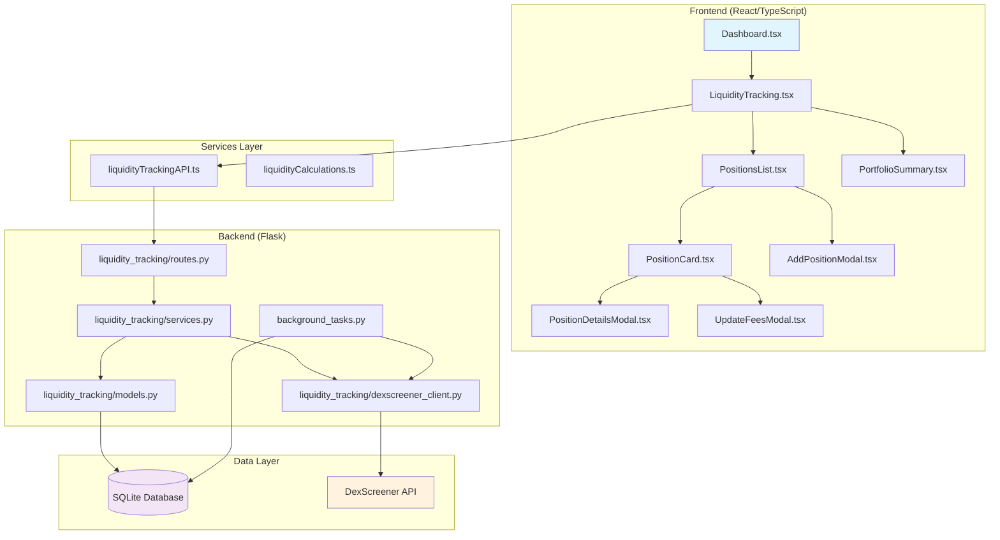

# Concentrated Liquidity Position Tracking System - Technical Specification

## Overview

This document provides a comprehensive technical specification for adding a Concentrated Liquidity (CL) position tracking system to the existing trading dashboard. The implementation is designed to be **purely additive** - no modifications to existing application logic are required.

## Current Architecture Analysis

### Backend (Flask)
- **Structure**: Blueprint-based routing system with modular organization
- **API Design**: Rate-limited endpoints with configuration management  
- **Data Integration**: Market data integration patterns established via [`app/market_data.py`](backend/app/market_data.py)
- **Configuration**: Local config pattern via [`local_config.py`](backend/local_config.py)
- **No Database**: Currently uses file-based data processing

### Frontend (React/TypeScript)
- **Navigation**: Tab-based system in [`Dashboard.tsx`](src/components/Dashboard.tsx) (8 existing tabs)
- **State Management**: Context API via [`DataContext.tsx`](src/context/DataContext.tsx)
- **UI Framework**: Chakra UI component library
- **Services**: Organized service layer in [`src/services/`](src/services/)
- **Type Safety**: Comprehensive TypeScript interfaces in [`src/types/`](src/types/)

### Existing Trade Tracking Patterns
- **Trade Types**: Comprehensive options trading support via [`tradeTracker.ts`](src/types/tradeTracker.ts)
- **Database**: Client-side storage via [`tradeTrackerDB.ts`](src/services/tradeTrackerDB.ts)
- **Components**: Modular component structure in [`src/components/tradeTracker/`](src/components/tradeTracker/)

## Target Requirements

### Protocol Support
- **Primary Target**: HyperEVM chain with HyperSwap positions
- **Expansion Ready**: Architecture designed for multi-protocol support

### Data Tracking
- **Core Data**: Token pair, price range, liquidity amount, entry/exit dates
- **Financial Metrics**: Initial investment, current value, fees collected, impermanent loss, APR/yield
- **Status Management**: Position status (active/closed)

### Monitoring Level
- **Update Frequency**: Automatic price updates every 15-30 minutes
- **Alerting**: Basic email/browser notifications for out-of-range positions
- **Fee Management**: Manual fee updates with historical tracking

## Database Schema Design

Since the current system doesn't use a backend database, we'll implement SQLite for the CL tracking system:

```sql
-- cl_positions table
CREATE TABLE cl_positions (
    id TEXT PRIMARY KEY,
    token_pair TEXT NOT NULL,           -- e.g., "USDC/ETH"
    protocol TEXT DEFAULT 'HyperSwap',  -- Protocol name
    chain TEXT DEFAULT 'HyperEVM',      -- Blockchain
    price_range_min REAL NOT NULL,     -- Lower price bound
    price_range_max REAL NOT NULL,     -- Upper price bound
    liquidity_amount REAL NOT NULL,    -- Amount of liquidity provided
    initial_investment REAL NOT NULL,  -- Initial USD investment
    entry_date TEXT NOT NULL,          -- ISO date string
    exit_date TEXT,                    -- ISO date string (null if active)
    status TEXT DEFAULT 'active',      -- 'active' or 'closed'
    fees_collected REAL DEFAULT 0,     -- Manually updated fees
    notes TEXT DEFAULT '',             -- User notes
    created_at INTEGER NOT NULL,       -- Unix timestamp
    updated_at INTEGER NOT NULL        -- Unix timestamp
);

-- cl_price_history table (for tracking price movements)
CREATE TABLE cl_price_history (
    id INTEGER PRIMARY KEY AUTOINCREMENT,
    position_id TEXT NOT NULL,
    token_pair TEXT NOT NULL,
    price REAL NOT NULL,              -- Current price of the pair
    timestamp INTEGER NOT NULL,       -- Unix timestamp
    source TEXT DEFAULT 'dexscreener', -- Data source
    FOREIGN KEY (position_id) REFERENCES cl_positions (id)
);

-- cl_fee_history table (for manual fee updates)
CREATE TABLE cl_fee_history (
    id INTEGER PRIMARY KEY AUTOINCREMENT,
    position_id TEXT NOT NULL,
    fees_amount REAL NOT NULL,        -- Fee amount collected
    cumulative_fees REAL NOT NULL,    -- Total fees to date
    update_date TEXT NOT NULL,        -- ISO date string
    notes TEXT DEFAULT '',            -- User notes about fee update
    FOREIGN KEY (position_id) REFERENCES cl_positions (id)
);
```

## Backend Implementation Structure

### Directory Structure
```
backend/
├── app/
│   ├── liquidity_tracking/
│   │   ├── __init__.py
│   │   ├── models.py              # Database models and schema
│   │   ├── routes.py              # API endpoints
│   │   ├── services.py            # Business logic
│   │   ├── dexscreener_client.py  # DexScreener API integration
│   │   └── price_monitor.py       # Background price monitoring
│   ├── database.py                # SQLite database setup
│   └── background_tasks.py        # Scheduled tasks
```

### API Endpoints Design

```python
# backend/app/liquidity_tracking/routes.py
from flask import Blueprint

liquidity_bp = Blueprint('liquidity', __name__, url_prefix='/api/liquidity')

# Position Management
@liquidity_bp.route('/positions', methods=['GET'])          # Get all positions
@liquidity_bp.route('/positions', methods=['POST'])         # Create new position
@liquidity_bp.route('/positions/<id>', methods=['GET'])     # Get specific position
@liquidity_bp.route('/positions/<id>', methods=['PUT'])     # Update position
@liquidity_bp.route('/positions/<id>', methods=['DELETE'])  # Close position

# Fee Management
@liquidity_bp.route('/positions/<id>/fees', methods=['POST']) # Update fees manually
@liquidity_bp.route('/positions/<id>/fees', methods=['GET'])  # Get fee history

# Price Data
@liquidity_bp.route('/prices/<token_pair>', methods=['GET']) # Get current price
@liquidity_bp.route('/positions/<id>/price-history', methods=['GET']) # Price history

# Analytics
@liquidity_bp.route('/analytics/summary', methods=['GET'])   # Portfolio summary
@liquidity_bp.route('/analytics/performance', methods=['GET']) # Performance metrics
```

### Database Models

```python
# backend/app/liquidity_tracking/models.py
import sqlite3
from datetime import datetime
from typing import List, Optional, Dict, Any

class CLPositionModel:
    def __init__(self, db_path: str):
        self.db_path = db_path
        self.init_database()
    
    def init_database(self):
        """Initialize database tables"""
        # Implementation for table creation
        
    def create_position(self, position_data: Dict[str, Any]) -> str:
        """Create new CL position"""
        # Implementation
        
    def get_positions(self, status: Optional[str] = None) -> List[Dict[str, Any]]:
        """Get all positions with optional status filter"""
        # Implementation
        
    def update_position(self, position_id: str, updates: Dict[str, Any]) -> bool:
        """Update existing position"""
        # Implementation
        
    def close_position(self, position_id: str, exit_data: Dict[str, Any]) -> bool:
        """Close a position"""
        # Implementation
```

### DexScreener Integration

```python
# backend/app/liquidity_tracking/dexscreener_client.py
import requests
from typing import Dict, Optional
from app.rate_limiter import rate_limiter

class DexScreenerClient:
    BASE_URL = 'https://api.dexscreener.com/latest'
    
    @rate_limiter(rate=300, per=60.0, burst=10)
    def get_token_price(self, token_pair: str, chain: str = 'hyperevm') -> Optional[Dict]:
        """Get current price for token pair"""
        # Implementation for price fetching
        
    def get_pair_info(self, token_address: str) -> Optional[Dict]:
        """Get detailed pair information"""
        # Implementation
```

## Frontend Integration

### Navigation Integration

Update [`Dashboard.tsx`](src/components/Dashboard.tsx):

```typescript
// Line 86, 92: Update tab arrays
const tabNames = ['summary', 'performance', 'tokens', 'trends', 'history', 'options', 'tradetracker', 'chartanalysis', 'liquidity'];

// Line 200: Add new tab in TabList
<Tab>Liquidity Tracking</Tab>

// Line 227: Add new TabPanel
<TabPanel>
  <LiquidityTracking />
</TabPanel>
```

### Component Structure

```
src/
├── components/
│   ├── liquidityTracking/
│   │   ├── LiquidityTracking.tsx          # Main container
│   │   ├── PositionsList.tsx              # Active positions list
│   │   ├── AddPositionModal.tsx           # Create new position
│   │   ├── PositionDetailsModal.tsx       # View/edit position
│   │   ├── UpdateFeesModal.tsx            # Manual fee updates
│   │   ├── PositionCard.tsx               # Individual position card
│   │   ├── PerformanceChart.tsx           # Position performance chart
│   │   ├── PortfolioSummary.tsx           # Overall portfolio metrics
│   │   └── PriceRangeVisualizer.tsx       # Visual price range indicator
├── services/
│   ├── liquidityTrackingAPI.ts            # API service layer
│   └── liquidityCalculations.ts           # IL and yield calculations
├── types/
│   └── liquidityTracking.ts               # TypeScript interfaces
```

### Type Definitions

```typescript
// src/types/liquidityTracking.ts
export interface CLPosition {
  id: string;
  tokenPair: string;
  protocol: string;
  chain: string;
  priceRangeMin: number;
  priceRangeMax: number;
  liquidityAmount: number;
  initialInvestment: number;
  entryDate: string;
  exitDate?: string;
  status: 'active' | 'closed';
  feesCollected: number;
  notes: string;
  createdAt: number;
  updatedAt: number;
  
  // Calculated fields
  currentValue?: number;
  impermanentLoss?: number;
  totalReturn?: number;
  apr?: number;
  isInRange?: boolean;
  currentPrice?: number;
}

export interface CLPriceHistory {
  id: number;
  positionId: string;
  tokenPair: string;
  price: number;
  timestamp: number;
  source: string;
}

export interface CLFeeUpdate {
  id: number;
  positionId: string;
  feesAmount: number;
  cumulativeFees: number;
  updateDate: string;
  notes: string;
}

export interface CLPortfolioSummary {
  totalPositions: number;
  activePositions: number;
  totalInvestment: number;
  currentValue: number;
  totalFeesCollected: number;
  totalImpermanentLoss: number;
  averageAPR: number;
  bestPerformingPosition: string;
  worstPerformingPosition: string;
}
```

### API Service Layer

```typescript
// src/services/liquidityTrackingAPI.ts
import { CLPosition, CLPortfolioSummary, CLFeeUpdate } from '../types/liquidityTracking';

class LiquidityTrackingAPI {
  private baseURL = '/api/liquidity';

  async getPositions(status?: 'active' | 'closed'): Promise<CLPosition[]> {
    // Implementation
  }

  async createPosition(positionData: Partial<CLPosition>): Promise<CLPosition> {
    // Implementation
  }

  async updatePosition(id: string, updates: Partial<CLPosition>): Promise<CLPosition> {
    // Implementation
  }

  async closePosition(id: string, exitData: any): Promise<CLPosition> {
    // Implementation
  }

  async updateFees(positionId: string, feeData: Partial<CLFeeUpdate>): Promise<void> {
    // Implementation
  }

  async getPortfolioSummary(): Promise<CLPortfolioSummary> {
    // Implementation
  }

  async getCurrentPrice(tokenPair: string): Promise<number> {
    // Implementation
  }
}

export const liquidityAPI = new LiquidityTrackingAPI();
```

### Main Component Structure

```typescript
// src/components/liquidityTracking/LiquidityTracking.tsx
import React, { useState, useEffect } from 'react';
import { Box, Tabs, TabList, TabPanels, Tab, TabPanel } from '@chakra-ui/react';
import PositionsList from './PositionsList';
import PortfolioSummary from './PortfolioSummary';
import { CLPosition, CLPortfolioSummary } from '../../types/liquidityTracking';
import { liquidityAPI } from '../../services/liquidityTrackingAPI';

const LiquidityTracking: React.FC = () => {
  const [positions, setPositions] = useState<CLPosition[]>([]);
  const [summary, setSummary] = useState<CLPortfolioSummary | null>(null);
  const [loading, setLoading] = useState(true);

  useEffect(() => {
    loadData();
  }, []);

  const loadData = async () => {
    try {
      setLoading(true);
      const [positionsData, summaryData] = await Promise.all([
        liquidityAPI.getPositions(),
        liquidityAPI.getPortfolioSummary()
      ]);
      setPositions(positionsData);
      setSummary(summaryData);
    } catch (error) {
      console.error('Failed to load liquidity data:', error);
    } finally {
      setLoading(false);
    }
  };

  return (
    <Box>
      <Tabs variant="line" colorScheme="brand">
        <TabList>
          <Tab>Portfolio Overview</Tab>
          <Tab>Active Positions</Tab>
          <Tab>Closed Positions</Tab>
          <Tab>Analytics</Tab>
        </TabList>

        <TabPanels>
          <TabPanel>
            <PortfolioSummary summary={summary} loading={loading} />
          </TabPanel>
          <TabPanel>
            <PositionsList 
              positions={positions.filter(p => p.status === 'active')} 
              loading={loading}
              onRefresh={loadData}
            />
          </TabPanel>
          <TabPanel>
            <PositionsList 
              positions={positions.filter(p => p.status === 'closed')} 
              loading={loading}
              onRefresh={loadData}
            />
          </TabPanel>
          <TabPanel>
            {/* Analytics components */}
          </TabPanel>
        </TabPanels>
      </Tabs>
    </Box>
  );
};

export default LiquidityTracking;
```

## Configuration Updates

### Backend Configuration

Add to [`backend/local_config.py`](backend/local_config.py):

```python
# DexScreener API configuration
DEXSCREENER_BASE_URL = 'https://api.dexscreener.com/latest'
DEXSCREENER_RATE_LIMIT = {
    "rate": 300,  # 300 requests per minute (free tier)
    "per": 60.0,
    "burst": 10
}

# Price monitoring configuration
PRICE_UPDATE_INTERVAL = 1800  # 30 minutes in seconds
CL_DATABASE_PATH = 'instance/cl_positions.db'

# Email notifications (optional)
SMTP_SERVER = 'smtp.gmail.com'
SMTP_PORT = 587
EMAIL_USERNAME = 'your-email@gmail.com'
EMAIL_PASSWORD = 'your-app-password'
NOTIFICATION_EMAILS = ['user@example.com']

# HyperEVM specific configuration
HYPEREVM_CHAIN_ID = 'hyperevm'
HYPERSWAP_FACTORY_ADDRESS = '0x...'  # To be configured
```

### Flask App Integration

Update [`backend/app/__init__.py`](backend/app/__init__.py):

```python
# Add after line 117
# Register liquidity tracking routes
try:
    from app.liquidity_tracking.routes import liquidity_bp
    app.register_blueprint(liquidity_bp)
    logger.info("Registered liquidity tracking routes")
except Exception as e:
    logger.error(f"Failed to register liquidity tracking routes: {str(e)}")

# Initialize background tasks
try:
    from app.background_tasks import start_price_monitoring
    start_price_monitoring()
    logger.info("Started background price monitoring")
except Exception as e:
    logger.error(f"Failed to start background tasks: {str(e)}")
```

## Implementation Phases

### Phase 1: Core Infrastructure (Week 1-2)
**Backend Tasks:**
- [ ] Create SQLite database schema and models
- [ ] Implement basic CRUD API endpoints
- [ ] Set up database initialization and migrations
- [ ] Create position management service layer

**Frontend Tasks:**
- [ ] Add new "Liquidity Tracking" tab to Dashboard
- [ ] Create basic LiquidityTracking container component
- [ ] Implement AddPositionModal for manual position entry
- [ ] Create PositionsList component with basic display

**Integration:**
- [ ] Register new blueprint in Flask app
- [ ] Create API service layer for frontend
- [ ] Add TypeScript type definitions
- [ ] Update configuration files

### Phase 2: Data Integration (Week 3)
**Backend Tasks:**
- [ ] Implement DexScreener API client
- [ ] Create price monitoring service
- [ ] Set up background price updates (15-30 min intervals)
- [ ] Add price history tracking

**Frontend Tasks:**
- [ ] Implement real-time position value calculations
- [ ] Create PriceRangeVisualizer component
- [ ] Add current price display to position cards
- [ ] Implement position status indicators (in-range/out-of-range)

### Phase 3: Advanced UI (Week 4)
**Frontend Tasks:**
- [ ] Create PortfolioSummary dashboard
- [ ] Implement PerformanceChart component
- [ ] Build PositionDetailsModal with full position info
- [ ] Create UpdateFeesModal for manual fee tracking
- [ ] Add impermanent loss calculations and display

**Backend Tasks:**
- [ ] Implement portfolio analytics endpoints
- [ ] Add fee history tracking
- [ ] Create performance calculation services

### Phase 4: Monitoring & Alerts (Week 5)
**Backend Tasks:**
- [ ] Implement out-of-range position detection
- [ ] Create email notification system
- [ ] Add alert configuration and management
- [ ] Implement notification history

**Frontend Tasks:**
- [ ] Add browser notification support
- [ ] Create alert configuration UI
- [ ] Implement notification history display
- [ ] Add alert status indicators

## Architecture Diagram



## Key Integration Points

### Navigation Integration
- **Location**: [`src/components/Dashboard.tsx`](src/components/Dashboard.tsx) lines 86, 92, 200
- **Change**: Add 'liquidity' to tab arrays and create new Tab/TabPanel
- **Impact**: Purely additive - no existing functionality affected

### State Management
- **Pattern**: Follow existing DataContext pattern
- **Scope**: Create separate LiquidityContext or extend existing context
- **Integration**: Use existing state management patterns from trade tracker

### API Integration
- **Pattern**: Follow existing blueprint registration in [`app/__init__.py`](backend/app/__init__.py)
- **Rate Limiting**: Use existing rate limiter patterns from [`app/rate_limiter.py`](backend/app/rate_limiter.py)
- **Error Handling**: Follow existing error handling patterns

### Database Integration
- **Approach**: Add SQLite database alongside existing file-based system
- **Location**: Store database in `backend/instance/` directory
- **Migration**: Initialize database on first run, no existing data migration needed

## Security Considerations

### API Security
- Rate limiting on all endpoints
- Input validation and sanitization
- SQL injection prevention through parameterized queries

### Data Protection
- Local database storage (no sensitive data transmission)
- Optional email credentials stored in local config (not version controlled)
- Position data remains private to user

### Error Handling
- Graceful degradation when DexScreener API is unavailable
- Comprehensive error logging
- User-friendly error messages

## Performance Considerations

### Backend Performance
- Database indexing on frequently queried fields
- Efficient price update batching
- Rate limiting to prevent API abuse
- Background task optimization

### Frontend Performance
- Lazy loading of position details
- Memoization of expensive calculations
- Efficient re-rendering with React.memo
- Pagination for large position lists

### Scalability
- Database design supports multiple protocols/chains
- Modular component architecture for easy extension
- Configurable update intervals
- Extensible notification system

## Testing Strategy

### Backend Testing
- Unit tests for database models and services
- Integration tests for API endpoints
- Mock DexScreener API for testing
- Database migration testing

### Frontend Testing
- Component unit tests with React Testing Library
- Integration tests for user workflows
- Mock API responses for testing
- Accessibility testing

### End-to-End Testing
- Position creation and management workflows
- Price update and notification flows
- Error handling scenarios
- Performance testing with large datasets

## Deployment Considerations

### Development Setup
- SQLite database auto-initialization
- Development seed data for testing
- Hot reload support for both frontend and backend
- Environment-specific configuration

### Production Deployment
- Database backup and recovery procedures
- Monitoring and logging setup
- Error tracking integration
- Performance monitoring

### Maintenance
- Database cleanup procedures for old price history
- Log rotation and cleanup
- API rate limit monitoring
- System health checks

## Success Metrics

### Functional Metrics
- [ ] Successfully track CL positions on HyperEVM/HyperSwap
- [ ] Accurate price updates every 15-30 minutes
- [ ] Reliable out-of-range notifications
- [ ] Manual fee tracking functionality

### Technical Metrics
- [ ] Zero impact on existing functionality
- [ ] API response times under 500ms
- [ ] 99.9% uptime for price monitoring
- [ ] Successful integration with existing architecture

### User Experience Metrics
- [ ] Intuitive position management interface
- [ ] Clear performance visualization
- [ ] Responsive design across devices
- [ ] Accessible interface for all users

This specification provides a complete roadmap for implementing the CL position tracking system while maintaining consistency with existing architecture patterns and ensuring the system is purely additive to the current functionality.