# Timeframe Isolation Architecture

## Overview

This document describes the critical timeframe isolation system implemented to enable parallel trades on different timeframes for the same ticker. This architecture ensures that trades on different timeframes (15m, 1h, 4h, etc.) operate completely independently without interference.

## Problem Statement

### Original Issue
The system was using unified context across all timeframes, causing:
- 15m chart analysis interfering with 1h trades
- Trigger checking using wrong timeframe data (15m data for 1h trades)
- Context synchronization warnings
- Inability to have parallel trades on different timeframes

### User Impact
- Users couldn't analyze a 15m chart while having an active 1h trade
- System would incorrectly process 1h trades using 15m market data
- Context synchronization failures leading to unreliable AI analysis

## Solution Architecture

### Core Principle: Complete Timeframe Isolation
Each timeframe operates as a completely separate trading environment:
- 15m trades only interact with 15m data and analysis
- 1h trades only interact with 1h data and analysis
- No cross-timeframe interference

## Implementation Details

### 1. Database Schema (Already Supported)
```sql
CREATE TABLE active_trades (
    id INTEGER PRIMARY KEY AUTOINCREMENT,
    ticker TEXT NOT NULL,
    timeframe TEXT NOT NULL,  -- Critical: Stores trade's original timeframe
    -- ... other fields
);
```

### 2. Backend Changes

#### A. Active Trade Service (`backend/services/active_trade_service.py`)

**Updated Method Signature:**
```python
def get_trade_context_for_ai(self, ticker: str, current_price: float, timeframe: Optional[str] = None):
    # CRITICAL FIX: Filter by timeframe to enable parallel trades
    trade = self.get_active_trade(ticker, timeframe)
```

**Key Changes:**
- Added `timeframe` parameter to `get_trade_context_for_ai()`
- Filters trades by timeframe to ensure isolation
- Logs when no trade found for specific timeframe

#### B. Analysis Context Service (`backend/services/analysis_context_service.py`)

**Critical Fix - Trigger Checking:**
```python
# BEFORE (BROKEN):
trigger_status = self._check_entry_trigger_hit(
    ticker, current_timeframe,  # Wrong: using analysis timeframe
    # ...
)

# AFTER (FIXED):
trade_timeframe = active_trade_context.get('timeframe', current_timeframe)
trigger_status = self._check_entry_trigger_hit(
    ticker, trade_timeframe,  # Correct: using trade's original timeframe
    # ...
)
```

**Key Changes:**
- Uses trade's original timeframe for trigger checking
- Passes timeframe parameter to `get_trade_context_for_ai()`
- Enhanced logging for timeframe-specific operations

#### C. API Routes (`backend/app/routes.py`)

**Existing Support:**
```python
@api_bp.route('/active-trades/<ticker>', methods=['GET'])
def get_active_trade(ticker):
    timeframe = request.args.get('timeframe')  # Already supported!
    active_trade = trade_service.get_active_trade(ticker, timeframe)
```

### 3. Frontend Changes

#### A. Context Synchronization Service (`src/services/contextSynchronizationService.ts`)

**URL Construction:**
```typescript
// BEFORE (BROKEN):
const activeTradeUrl = `http://localhost:5000/api/active-trades/${ticker}`;

// AFTER (FIXED):
const activeTradeUrl = `http://localhost:5000/api/active-trades/${ticker}?timeframe=${timeframe}`;
```

**Timeframe Validation:**
```typescript
if (trade.timeframe !== timeframe) {
  console.log(`📭 [ContextSync] Trade timeframe (${trade.timeframe}) doesn't match analysis timeframe (${timeframe}) - treating as fresh analysis`);
  // Fall through to fresh analysis
}
```

**Key Changes:**
- Includes timeframe parameter in API calls
- Validates timeframe matches before processing trades
- Enhanced logging for timeframe-specific operations

## Flow Diagrams

### Before Fix (Broken)

```mermaid
sequenceDiagram
    participant F as Frontend (15m)
    participant B as Backend
    participant DB as Database
    
    F->>B: Analyze 15m chart
    F->>B: GET /active-trades/BTCUSD (no timeframe)
    B->>DB: SELECT * FROM active_trades WHERE ticker='BTCUSD'
    DB-->>B: Returns 1h trade
    B->>B: Use 15m data to check 1h trade triggers ❌
    B-->>F: Context sync warning ⚠️
```


### After Fix (Working)

```mermaid
sequenceDiagram
    participant F as Frontend (15m)
    participant B as Backend
    participant DB as Database
    
    F->>B: Analyze 15m chart
    F->>B: GET /active-trades/BTCUSD?timeframe=15m
    B->>DB: SELECT * FROM active_trades WHERE ticker='BTCUSD' AND timeframe='15m'
    DB-->>B: No 15m trade found
    B-->>F: Fresh analysis ✅
    
    Note over F,B: 1h trade remains untouched
```


## Parallel Trade Scenarios

### Scenario 1: Multiple Timeframes, Same Ticker
```
BTCUSD Trades:
├── 15m: BUY at $118,500 (active)
├── 1h:  SELL at $115,000 (waiting)
└── 4h:  SELL at $120,000 (active)
```

**Behavior:**
- 15m analysis only sees 15m trade
- 1h analysis only sees 1h trade
- 4h analysis only sees 4h trade
- Complete isolation maintained

### Scenario 2: User Switches Timeframes
```
User Action: Switch from 1h chart to 15m chart
Result: 15m analysis treats as fresh (ignores 1h trade)
```

## Testing Strategy

### Comprehensive Test Suite (`src/tests/timeframeIsolation.test.ts`)

**Test Categories:**
1. **Context Sync Timeframe Filtering**
   - Verifies API calls include timeframe parameters
   - Tests timeframe mismatch detection
   - Validates proper isolation

2. **Parallel Trade Scenarios**
   - Tests multiple trades on different timeframes
   - Validates independence of timeframe operations
   - Real-world scenario testing

3. **Context Validation**
   - Tests trigger activation context
   - Validates context mismatch detection
   - Error handling verification

4. **Integration Tests**
   - User switching timeframes
   - Backend filtering validation
   - End-to-end isolation testing

**Test Results:**
- ✅ 13 new timeframe isolation tests
- ✅ All 147 total tests passing
- ✅ No regressions detected

## API Changes

### Backend Endpoints

#### GET /active-trades/{ticker}
**Query Parameters:**
- `timeframe` (optional): Filter trades by timeframe

**Examples:**
```bash
# Get any active trade for BTCUSD
GET /active-trades/BTCUSD

# Get only 15m trades for BTCUSD
GET /active-trades/BTCUSD?timeframe=15m

# Get only 1h trades for BTCUSD
GET /active-trades/BTCUSD?timeframe=1h
```

### Frontend Services

#### Context Synchronization
- Always includes timeframe in API calls
- Validates timeframe matches before processing
- Falls back to fresh analysis for mismatched timeframes

## Configuration

### Timeframe Support
The system supports all standard trading timeframes:
- `1m`, `5m`, `15m`, `30m` (intraday)
- `1h`, `4h` (hourly)
- `1d`, `1w` (daily/weekly)

### Database Indexing
Recommended index for performance:
```sql
CREATE INDEX idx_active_trades_ticker_timeframe ON active_trades(ticker, timeframe);
```

## Monitoring and Logging

### Key Log Messages

**Frontend:**
```
🔍 [ContextSync] Fetching active trade from: .../BTCUSD?timeframe=15m
📭 [ContextSync] Trade timeframe (1h) doesn't match analysis timeframe (15m)
🎯 [ContextSync] Found waiting trade for BTCUSD on 15m timeframe
```

**Backend:**
```
🎯 Checking trigger for BTCUSD: entry_price=$115000.0, action=sell, time_window=48h
📭 [TRADE CONTEXT] No active trade found for BTCUSD on 15m timeframe
```

## Performance Considerations

### Database Queries
- Timeframe filtering reduces query result sets
- Indexed queries for optimal performance
- No impact on existing functionality

### Memory Usage
- Minimal overhead from timeframe parameters
- No additional caching required
- Efficient isolation implementation

## Security Considerations

### Data Isolation
- Complete separation between timeframes
- No data leakage between timeframe contexts
- Maintains trade confidentiality per timeframe

### API Security
- Timeframe parameter validation
- No additional authentication required
- Existing security measures maintained

## Migration Notes

### Backward Compatibility
- ✅ Existing API calls without timeframe still work
- ✅ Database schema already supports timeframes
- ✅ No breaking changes to existing functionality

### Deployment
- No database migrations required
- Frontend and backend can be deployed independently
- Gradual rollout possible

## Troubleshooting

### Common Issues

#### Context Synchronization Warning
**Symptom:** "Expected trigger activation but not detected in context"
**Cause:** Timeframe mismatch between trade and analysis
**Solution:** Verify timeframe isolation is working correctly

#### Trade Not Found
**Symptom:** No active trade found for specific timeframe
**Expected:** This is correct behavior when no trade exists for that timeframe
**Action:** Proceed with fresh analysis

#### Multiple Trades Showing
**Symptom:** Seeing trades from different timeframes
**Cause:** API call missing timeframe parameter
**Solution:** Ensure frontend includes timeframe in requests

### Debug Commands

**Check Active Trades by Timeframe:**
```bash
# Backend database query
SELECT ticker, timeframe, status, entry_price FROM active_trades WHERE ticker='BTCUSD';

# API test
curl "http://localhost:5000/api/active-trades/BTCUSD?timeframe=15m"
```

## Future Enhancements

### Potential Improvements
1. **Cross-Timeframe Analysis:** Optional correlation analysis between timeframes
2. **Timeframe Hierarchy:** Parent-child relationships between timeframes
3. **Portfolio View:** Unified view of all timeframe trades for a ticker
4. **Risk Management:** Cross-timeframe position sizing

### Monitoring Enhancements
1. **Metrics Dashboard:** Track trades per timeframe
2. **Performance Analytics:** Timeframe-specific performance metrics
3. **Alert System:** Notifications for timeframe-specific events

## Conclusion

The timeframe isolation architecture successfully enables parallel trades on different timeframes while maintaining complete independence. This critical enhancement allows users to:

- Analyze any timeframe without affecting other timeframe trades
- Maintain multiple positions on different timeframes for the same ticker
- Ensure accurate trigger checking using appropriate timeframe data
- Eliminate context synchronization issues

The implementation is robust, well-tested, and maintains backward compatibility while providing the foundation for advanced multi-timeframe trading strategies.