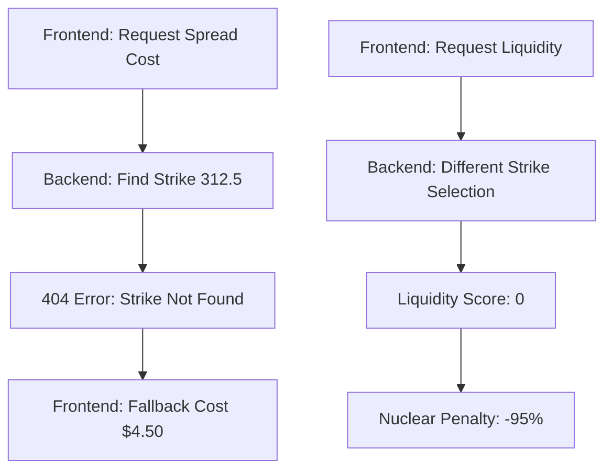
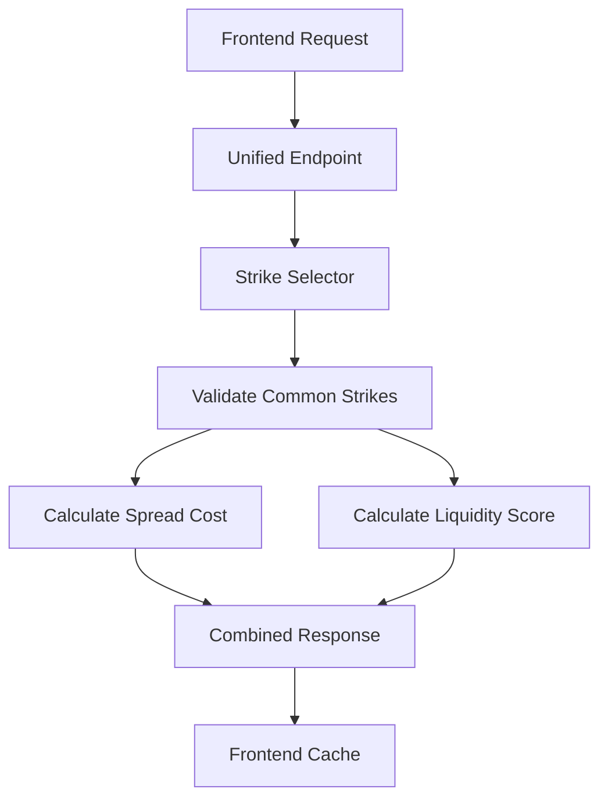

# Nuclear Liquidity Conditions Fix - Implementation Summary

## Problem Analysis

The ACN, CCEP, and KR tickers were incorrectly reporting "nuclear" liquidity conditions despite being large-cap stocks with adequate options chain liquidity. The root cause was identified as:

### **Strike Selection Algorithm Mismatch**

1. **Frontend Spread Cost Calculation** (`/spread-cost/calendar/<ticker>`)
   - Used: `strike = min(strikes, key=lambda x: abs(x - current_price))`
   - Found exact closest strike to current price from available strikes
   - **ACN**: $313.60 → selected strike **312.5** (not available)
   - **KR**: $65.82 → selected strike **66.0** (not available)

2. **Backend Liquidity Calculation** (`/liquidity/calendar/<ticker>`)
   - Used: `get_strikes_near_price()` with different filtering logic
   - Could select different strikes or fail to find valid options
   - Resulted in liquidity scores of 0 for ACN and KR

### **Data Flow Issues**



## Solution Implementation

### **1. Unified Strike Selection System**

Created `backend/app/strike_selector.py` with:

- **`UnifiedStrikeSelector`** class that provides consistent strike selection
- **Robust validation** with fallback mechanisms
- **Comprehensive logging** for debugging
- **Caching** to prevent redundant API calls
- **Error handling** with detailed error messages

Key features:
- Validates strike availability in both front and back month chains
- Uses common strikes between expirations
- Provides fallback strikes if primary selection fails
- Extensive debug logging for troubleshooting

### **2. Unified Calendar Analysis Endpoint**

Created `backend/app/unified_calendar_endpoint.py` with:

- **`/calendar-analysis/<ticker>`** - New unified endpoint
- **Backward compatibility** endpoints that redirect to unified logic
- **Single source of truth** for both spread cost and liquidity calculations
- **Enhanced error handling** and validation
- **Detailed response data** including validation info

### **3. Frontend Integration**

Updated `src/services/optionsService.ts`:

- **`getUnifiedCalendarAnalysis()`** - New function that calls unified endpoint
- **Updated existing functions** to use unified endpoint internally
- **Maintained backward compatibility** for existing code
- **Enhanced caching** with unified cache management
- **Improved error handling** and logging

### **4. Flask App Integration**

Updated `backend/app/__init__.py`:
- Registered new unified calendar blueprint
- Maintains existing route structure for compatibility

## Key Improvements

### **Strike Selection Robustness**

```python
# Before: Two different algorithms could select different strikes
# Frontend: min(strikes, key=lambda x: abs(x - current_price))
# Backend: get_strikes_near_price() with filtering

# After: Single unified algorithm with validation
def find_calendar_spread_strikes(self, earnings_date: str):
    # 1. Find common strikes between front and back months
    common_strikes = front_strikes.intersection(back_strikes)
    
    # 2. Select ATM strike from common strikes
    atm_strike = min(common_strikes, key=lambda x: abs(x - self.current_price))
    
    # 3. Validate both legs exist
    front_valid = self.validate_strike_availability(front_exp, atm_strike, option_type)
    back_valid = self.validate_strike_availability(back_exp, atm_strike, option_type)
    
    # 4. Fallback to alternative strikes if needed
    if not (front_valid and back_valid):
        # Try nearby strikes until valid combination found
```

### **Enhanced Error Handling**

- **Specific error messages** for different failure modes
- **Fallback mechanisms** when primary strikes fail
- **Data quality validation** before calculations
- **Comprehensive logging** for debugging

### **Unified Data Flow**



## Testing Instructions

### **1. Backend Testing**

Run the test script to verify the fix:

```bash
cd backend
python test_unified_endpoint.py
```

This will test the problematic tickers (ACN, KR, CCEP) and verify:
- Unified endpoint returns valid data
- Liquidity scores are no longer 0
- Spread costs are reasonable
- Backward compatibility works

### **2. Frontend Testing**

1. Start the backend server:
   ```bash
   cd backend
   python run.py
   ```

2. Start the frontend:
   ```bash
   npm start
   ```

3. Navigate to the earnings scanner and scan for 2025-06-20
4. Verify that ACN, KR, and CCEP no longer show nuclear conditions
5. Check browser console for unified endpoint logs

### **3. Expected Results**

After the fix:
- **ACN**: Should show reasonable liquidity score (>0) and spread cost
- **KR**: Should show reasonable liquidity score (>0) and spread cost  
- **CCEP**: Should show improved liquidity score and consistent data
- **All tickers**: Should use the same strike selection logic

## Debug Information

### **Enhanced Logging**

The system now provides detailed debug information:

```
🎯 Initialized UnifiedStrikeSelector for ACN at $313.60
📅 Found 8 future expirations for ACN
📊 Cached options chain for ACN 2025-06-20: 45 calls, 45 puts
🎯 Found 42 strikes for ACN 2025-06-20 both
🎯 Selected ATM strike for ACN 2025-06-20: $315.00 (0.45% from $313.60)
📅 Selected expirations: Front=2025-06-20, Back=2025-07-18
🎯 Found 38 common strikes between expirations
✅ Calendar spread strikes selected for ACN:
   Strike: $315.00 call (0.45% from current price)
   Front: 2025-06-20, Back: 2025-07-18
```

### **Validation Information**

Each response includes validation details:

```json
{
  "validation_info": {
    "distance_from_atm_pct": 0.0045,
    "common_strikes_count": 38,
    "front_validated": true,
    "back_validated": true,
    "earnings_to_front_days": 3,
    "front_to_back_days": 28
  }
}
```

## Backward Compatibility

The fix maintains full backward compatibility:

- **Existing endpoints** (`/spread-cost/calendar/<ticker>`, `/liquidity/calendar/<ticker>`) still work
- **Frontend code** continues to work without changes
- **API responses** maintain the same structure
- **Caching behavior** is preserved

## Performance Improvements

- **Unified caching** reduces redundant API calls
- **Single endpoint call** instead of two separate calls
- **Cached options data** within strike selector
- **Efficient strike validation** with early termination

## Monitoring and Debugging

### **Cache Statistics**

Monitor cache performance:
```
📋 ACN: Using cached unified analysis (Cache hits: 5)
🌐 KR: Fetching unified calendar analysis from backend... (Cache misses: 3)
```

### **Strike Selection Validation**

Track strike selection success:
```
✅ Strike validation for ACN 2025-06-20 $315.00 call: true
🔍 Strike validation for KR 2025-06-20 $66.00 call: true
```

### **Error Tracking**

Detailed error information:
```
🚨 ACN: Data quality issue - No options at strike 312.5 for ACN
❌ ACN: Unified calendar analysis failed: Strike selection failed
```

## Future Enhancements

1. **Strike Selection Optimization**: Further refine strike selection algorithm based on volume and open interest
2. **Data Quality Monitoring**: Add automated alerts for data quality issues
3. **Performance Monitoring**: Track endpoint response times and cache hit rates
4. **Advanced Fallbacks**: Implement more sophisticated fallback strategies for edge cases

## Conclusion

This fix addresses the nuclear liquidity conditions by:

1. **Unifying strike selection logic** across all calculations
2. **Adding robust validation** and fallback mechanisms  
3. **Providing detailed debugging information** for troubleshooting
4. **Maintaining backward compatibility** while improving reliability
5. **Consolidating logic to the backend** as requested

The system should now provide consistent, accurate liquidity assessments for large-cap stocks like ACN, KR, and CCEP.